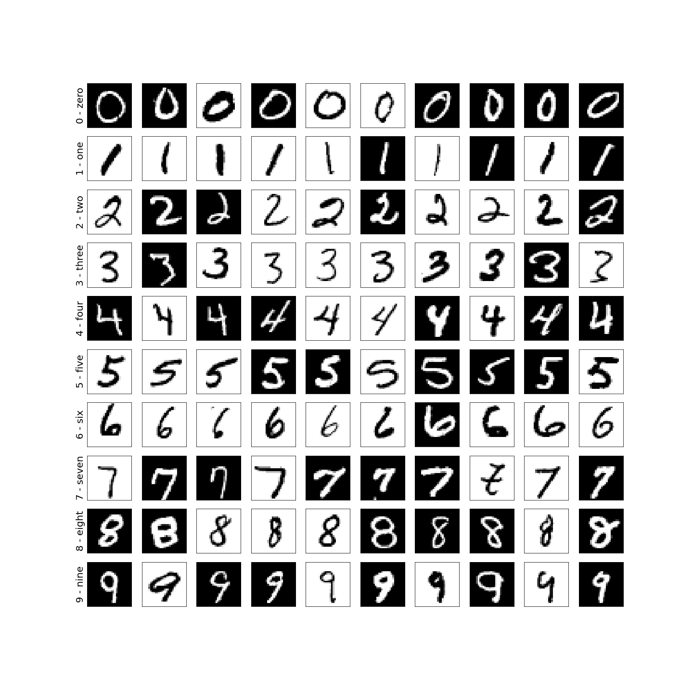
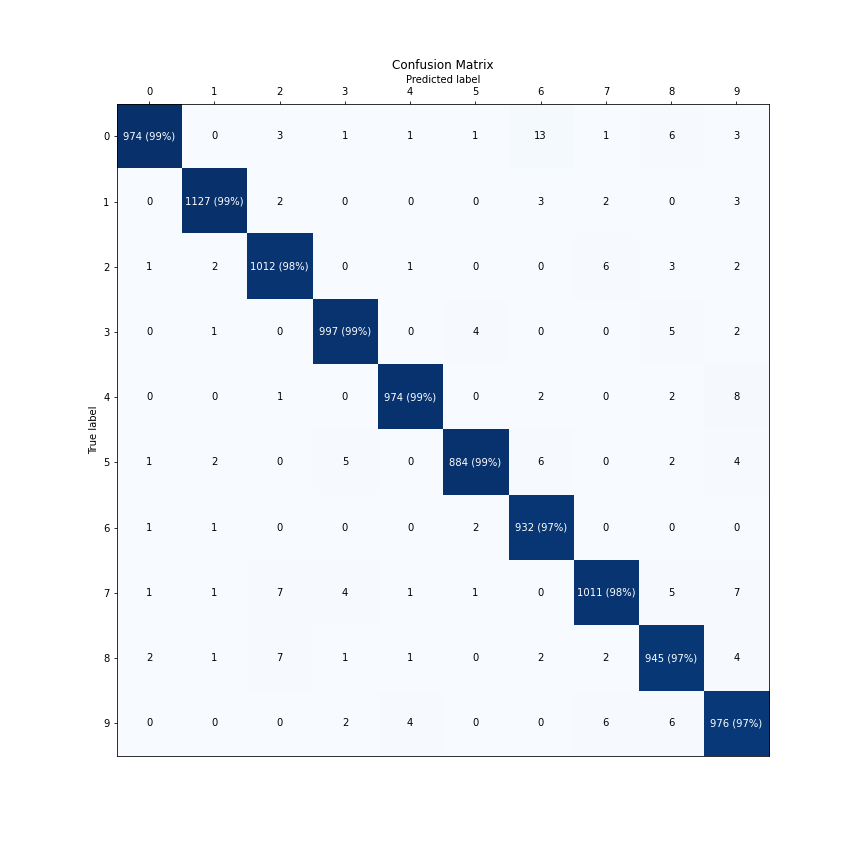

# Torchero - A training framework for pytorch #

**Torchero** is a library that works on top of the *PyTorch* framework built to
facilitate the training of Neural Networks.

[](https://github.com/juancruzsosa/torchero/actions)
[](https://codecov.io/gh/juancruzsosa/torchero)
[](https://pypi.org/project/torchero/)
[](https://www.python.org/downloads/)
[](https://opensource.org/licenses/MIT)
[](https://torchero.readthedocs.io/en/latest/?badge=latest)

## Features ##

It provides tools and utilities to:

- Set up a training process in a few lines of code.
- Monitor the training performance by checking several prebuilt metrics on a handy progress bar.
- Integrate a *TensorBoard* dashboard to visualize those metrics in an online manner with a minimal setup.
- Add custom functionality via Callbacks.
- NLP & Computer Vision: Datasets for text and image classification tasks.
       Pretrained Embedding Vectors, Models, etc.

## Installation ##

### From PyPI ###

```bash
pip install torchero
```

### From Source Code ###

```bash
git clone https://github.com/juancruzsosa/torchero
cd torchero
python setup.py install
```

## Quickstart - MNIST ##

### Loading the Data

```python
import torch
from torch import nn

import torchero
from torchero.models.vision import ImageClassificationModel
from torchero.callbacks import ProgbarLogger, ModelCheckpoint, CSVLogger
from torchero.utils.data import train_test_split
from torchero.utils.vision import show_imagegrid_dataset, transforms, datasets, download_image
from torchero.meters import ConfusionMatrix

from matplotlib import pyplot as plt
```

First we load the MNIST train and test datasets and visualize it using ``show_imagegrid_dataset``.
The Data Augmentation for this case will be a RandomInvert to flip the grayscale levels.

```python3
train_ds = datasets.MNIST(root='/tmp/data/mnist', download=True, train=True, transform=transforms.Compose([transforms.RandomInvert(),
                                                                                                  transforms.ToTensor()]))
test_ds = datasets.MNIST(root='/tmp/data/mnist', download=False, train=False, transform=transforms.ToTensor())

show_imagegrid_dataset(train_ds)
plt.show()
```



### Defining the Network

Let's define a Convolutional network of two layers followed by a Linear Module
as the classification layer.

```python
network = nn.Sequential(nn.Conv2d(in_channels=1, out_channels=32, kernel_size=5),
					  nn.ReLU(inplace=True),
					  nn.MaxPool2d(2),
					  nn.Conv2d(in_channels=32, out_channels=64, kernel_size=3),
					  nn.ReLU(inplace=True),
					  nn.MaxPool2d(2),
					  nn.Flatten(),
					  nn.Linear(5*5*64, 500),
					  nn.ReLU(inplace=True),
					  nn.Linear(500, 10))
```

The ImageClassificationModel is the module responsible to train the model,
evaluate a metric against a dataset, and predict from and input for multi-class classification tasks.

### Training the Model

To train the model we need to compile it first with a:

* an optimizer: 'adam'
* a loss which will be defaulted to ``cross_entropy``
* a list of metrics which will be defaulted to ``categorical_accuracy``, ``balanced_accuracy``)
* a list of callbacks:
    * ProgbarLogger to show training progress bar
    * ModelCheckpoint to make checkpoints if the model improves
    * CSVLogger to dump the metrics to a csv file after each epoch

```python
model = ImageClassificationModel(model=network, 
                                 transform=transforms.Compose([transforms.Grayscale(),
                                                               transforms.Resize((28,28)),
                                                               transforms.ToTensor()]),
                                 classes=[str(i) for i in range(10)])
model.compile(optimizer='adam',
              callbacks=[ProgbarLogger(notebook=True),
                         ModelCheckpoint('saved_model', mode='max', monitor='val_acc'),
                         CSVLogger('training_results.xml')])

if torch.cuda.is_available():
    model.cuda()

history = model.fit(train_ds,
                    test_ds,
                    batch_size=1024,
                    epochs=5)
```


### Displaying the training results

To see the training metrics

```python
history.plot(figsize=(20, 20), smooth=0.2)
plt.show()
```

The ``.evaluate`` returns the metrics for a new dataset.

```python
results = model.evaluate(test_ds, metrics=['categorical_accuracy', 'balanced_accuracy', ConfusionMatrix()])
for metric in ['acc', 'balanced_acc']:
    print("{}: {:.3f}%".format(metric, results[metric] * 100))
fig, ax = plt.subplots(figsize=(12,12))
results['confusion_matrix'].plot(fig=fig, ax=ax, classes=model.classes)
```


## Documentation ##

Additional documentation can be founded [here](https://readthedocs.org/projects/torchero/badge/?version=latest)
